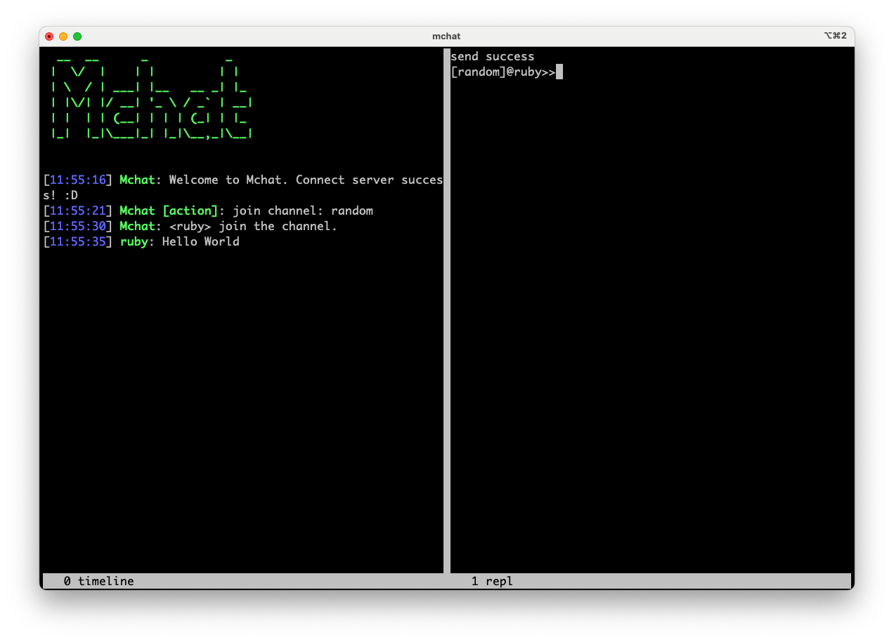

# Mchat

Mchat is IRC like chat client.

[Doc: 用Ruby打造一个命令行Slack](https://mark24code.github.io/ruby/2022/08/15/%E7%94%A8Ruby%E6%89%93%E9%80%A0%E4%B8%80%E4%B8%AA%E5%91%BD%E4%BB%A4%E8%A1%8CSlack.html)



This is Mchat client repo, server repo:

* [mchat_server](https://github.com/Mark24Code/mchat_server)

## Installation

install it yourself as:

    $ gem install mchat

## Usage

```ruby
# enter mchat
mchat

# /h for help
/h
```

或者使用Docker

直接使用

`docker run -it mark24code/mchat`


----

# Features

### repl

* [x] repl主流程
* [x] 命令模块化
* [x] help 命令
* [x] channel 命令
* [x] join 命令
* [x] name 命令
* [x] message 命令
* [x] leave 命令
* [x] quit 命令
* [x] clear 命令
* [x] default mode
* [x] boss mode
* [x] 存储 Pstore 实现取代文件
### timeline

* [x] timeline 独立
* [x] 支持简单命令
* [x] hook_quit

### union

* [x] 联合打开screen window
* [x] 联合关闭


### TODO features

* [ ] 密码登录用户，超级管理员
* [ ] 密码登录channel
* [x] 创建频道
* [x] 配置化
~~* [ ] temp~~
* [ ] 日志
~~* [ ] 优化代码，现在太分散~~
~~* [ ] 是否要实现一个 tail 包装命令~~
* [x] 打包下载
* [ ] README update HOWTO
* [x] 指令插件化
* [ ] set 命令
* [ ] 打字机效果(需要单独的渲染，不可以文件输出)
* [ ] eval 增加连续组合命令
* [ ] 可以封装在docker里
* [ ] 合理化初始化参数
* [ ] config 三个 path 和dir 部分处理
* [x] cli 关闭通知timeline关闭
* [ ] 加密消息


# mchat_experiment

Private Repo

[mchat_experiment](https://github.com/Mark24Code/mchat_experiment)

## 实验脚本

* module 的模块化写法
* 进程间 PStore 通信
  * 模块化
  * 面向对象实例

* Tempfile 的使用
* MessageQueue 线程队列的使用
* 使用 screen & screenrc 创造双屏应用

#### TUI

模拟一个前端基于命令的浏览器

* eventloop 模拟
* vnode 虚拟dom的模拟：jsx 构建cli界面
* hooks 模拟
* lambda_vnode 纯函数式的写法模拟jsx组件
* repl 时间循环模拟
* 基于Curses 封的TUI
* 基于消息队列封装的client

## License

The gem is available as open source under the terms of the [MIT License](https://opensource.org/licenses/MIT).

